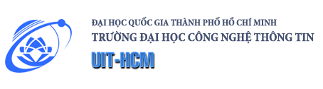

  

# ĐỒ ÁN CUỐI KỲ MÔN CHUYÊN ĐỀ MÁY HỌC VÀ TRÍ TUỆ NHÂN TẠO

- **Tên môn học**: CHUYÊN ĐỀ NGHIÊN CỨU MÁY HỌC VÀ TRÍ TUỆ NHÂN TẠO  
- **Mã lớp**: CS2310.CH190  
- **Giảng viên hướng dẫn**: TS. Lê Kim Hùng  

---

## Đề tài: Đọc hiểu và thực nghiệm lại mô hình LLaMP trên bài toán phân loại ảnh ít mẫu (Low-Shot Image Classification)

> **Tên paper**: [Large Language Models are Good Prompt Learners for Low-Shot Image Classification (CVPR 2024)](https://arxiv.org/abs/2312.04076)  
> **Tác giả**: Zhaoheng Zheng, Jingmin Wei, Xuefeng Hu, Haidong Zhu, Ram Nevatia  
> **Source gốc**: [GitHub repository](https://github.com/zhaohengz/llamp)

---
Mục tiêu của đồ án là đọc hiểu nội dung chính của bài báo, cài đặt và chạy lại mô hình theo mã nguồn chính thức nhằm xác nhận kết quả và đánh giá tính hiệu quả của phương pháp đề xuất.

